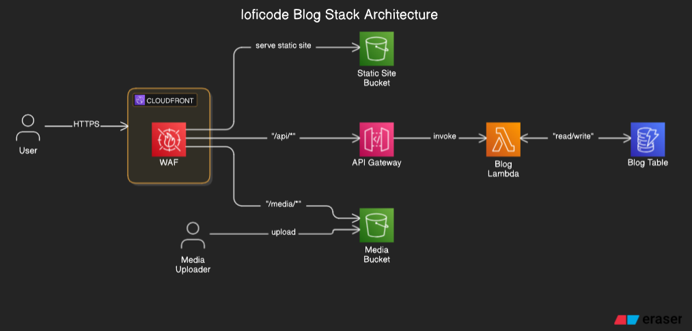

# lofi-code

loficode is my blog. It's built with a custom static site generator in Go. It uses [templ](https://templ.guide/) and [htmx](https://htmx.org/) via AWS Lambda and API Gateway for progressive enhancment. It serves pre-built static assets from S3 through CloudFront.

---

## Getting Started

### Local Development

Run the development loop using:
```bash
make dev
```

---

## Deployment

Deployment is triggered by a GitHub action, which uses Makefile which ultimately invokes Docker to build and AWS CLI + Cloudformation to actually deploy lambda, api gateway, s3, and cloudfront.

To trigger a full deployment manually:
```bash
make deploy
```

Otherwise, just create a Release in GitHub.

---

## Infrastructure Diagram

Below is the architecture diagram for the lofi-code stack:


